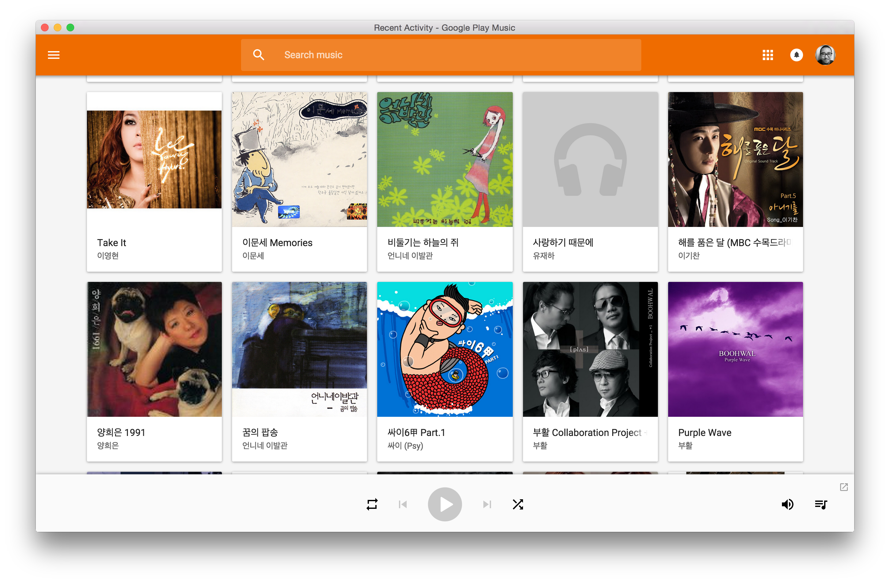

# GPMP
Google Play Music Player with [Electron][electron]




## Download
https://github.com/importre/gpmp/releases/latest


## Global Shortcuts
You can control music using your mac keyboard.
Just hiiiiiit :facepunch:

- <kbd>&lt;&lt;</kbd>,
- <kbd>>||</kbd>,
- or <kbd>&gt;&gt;</kbd>


## Development
```
$ npm install
$ npm start
```


## Deployment
Check `build_all.sh`. And build

```
$ npm run build
```


[electron]: http://electron.atom.io/
